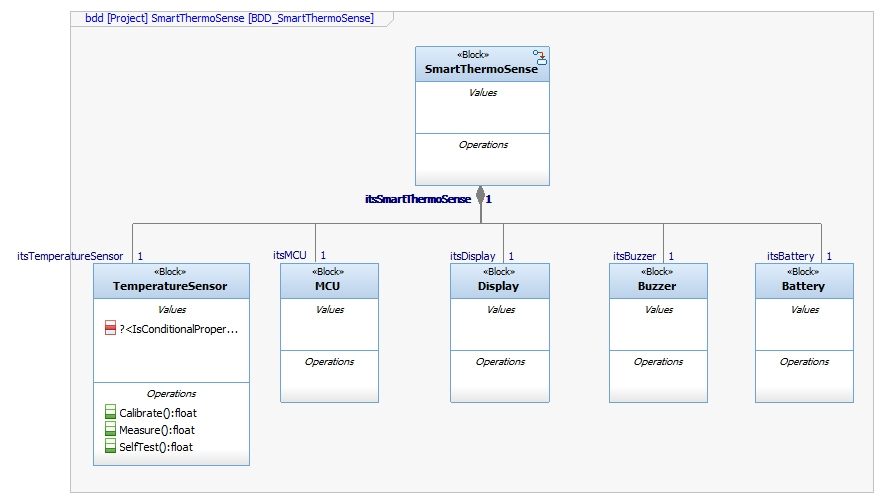
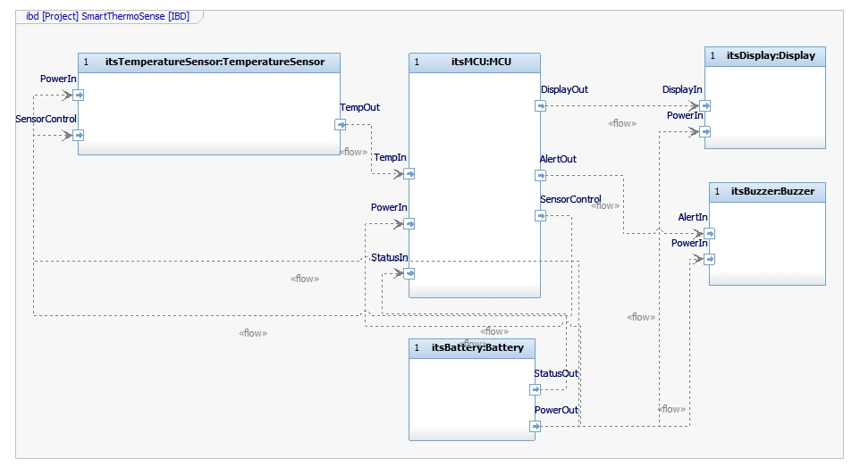
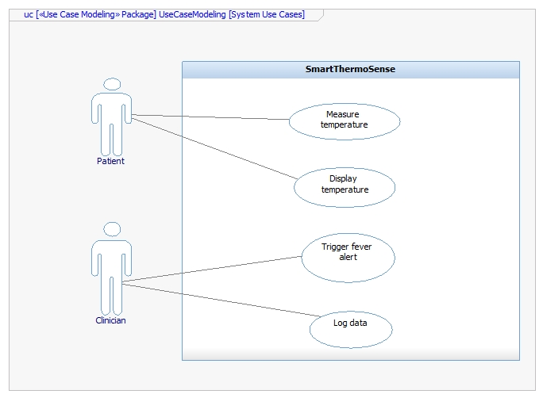
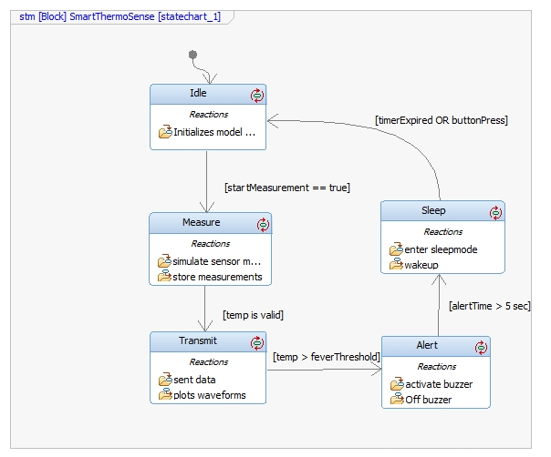
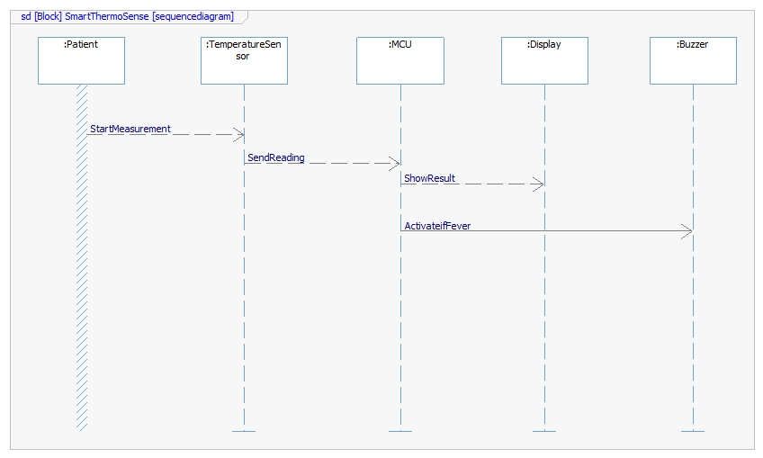

# PM Skills Showcase — MBSE: Smart ThermoSense

This page showcases my **Model-Based Systems Engineering (MBSE)** work on a simulated medical-device system: **Smart ThermoSense**, a compact digital thermometer.

---

## 🧠 Project Overview

- **Project Name:** ThermoSense  
- **Goal:** Demonstrate end-to-end MBSE: SysML modeling, requirements traceability, simulation, and test planning  
- **Relevance:** Highlights system architecture and behavioral modeling skills highly relevant to roles in automotive, medical device, and systems engineering  

---

## 📐 System Architecture (SysML Diagrams)

Here are screenshots of the SysML diagrams I created in IBM Rhapsody:

| Diagram | Description |
|---|---|
| **Block Definition Diagram (BDD)** | Defines the main system blocks: TempSensor, MCU, Display, Buzzer, Battery.    |
| **Internal Block Diagram (IBD)** | Shows how data and power flow: ports, connectors, and interactions.    |
| **Use Case Diagram** | Key use cases involving Patient: measurement, display, alert, sleep.    |
| **State Machine / Statechart** | State logic: Idle → Measure → Transmit → Alert → Sleep.    |
| **Sequence Diagram** | Message flow: Patient → Sensor → MCU → Display / Buzzer.    |

> **Note:** Replace each `./path/to/your/...` with the correct relative path where you upload your `.jpg` files in your GitHub repo.

---

## ✅ Requirements & Traceability

- **User Requirements (URS):**  
  - Measure body temperature within ± 0.2 °C  
  - Trigger a buzzer when fever detected  
  - Display the measured temperature clearly  
  - Enter low-power sleep mode after inactivity  

- **System Requirements (SRS):**  
  These map to SysML components (Sensor, MCU, Display, Buzzer) and behavioral logic (state machine).

- **Traceability:**  
  I maintain a traceability matrix (URS → SRS → Test Cases) to ensure coverage and verification.

---

## 📋 Test Planning ( Will be added later- Future scope )

- I defined test cases for:  
  1. Accuracy of temperature measurement  
  2. Display update speed  
  3. Buzzer activation on fever  
  4. Sleep mode functionality  
  5. Battery voltage compliance  

- These test cases are ready to be implemented using **Microfocus Quality Center (ALM)** or any test-management tool.

---

## 💬 My Role & Impact

- Designed system-level architecture using **SysML**  
- Created **state machine** logic to model operational scenarios    
- Built **traceability matrix** linking requirements to tests  
- Demonstrated a **MBSE mindset** that ensures safety, correctness, and maintainability  

---

